<p align="center">
  <pre align="center">
   _____                _______ __  
  /  _  \_______  ____ /  _____//__|_/  |_ 
 /  /_\  \_  __ \/    \/   \  __\|  \   __\
/    |    \  | \/   |  \    \_\  \  ||  |  
\____|__  /__|  |___|  /\______  /__||__|  
        \/           \/        \/          
  </pre>
</p>

<h3 align="center">Developer Control Platform</h3>

<p align="center">
  <em>A modern Git workflow tool with multi-account support, GitHub API integration, and automation.</em>
</p>

<p align="center">
  <a href="https://github.com/buchorim/arngit/releases/latest">
    
  </a>
  <a href="https://github.com/buchorim/arngit/releases/latest">
    
  </a>
  <a href="https://go.dev">
    
  </a>
  <a href="LICENSE">
    
  </a>
</p>

---

## Why ArnGit?

ArnGit is **not** a Git replacement. It's a **control layer** on top of Git that makes large-scale operations calm, understandable, and reversible.

```
arngit                     # Interactive dashboard
arngit push                # Push with account auto-config
arngit repo create myapp   # Create GitHub repo from terminal
arngit release create buchorim/myapp v2.0.0  # Ship a release
arngit bump minor          # Auto-increment version tag
```

### Key Principles

| Principle | Description |
|-----------|-------------|
| **Control** | Every destructive action requires confirmation |
| **Multi-Account** | Switch GitHub identities with one command |
| **Safety** | Repository protection prevents accidental pushes |
| **Automation** | Changelog, versioning, hooks - all built in |

---

## Installation

### Download Binary

Grab the latest release from [GitHub Releases](https://github.com/buchorim/arngit/releases/latest):

```bash
# Windows
curl -L -o arngit.exe https://github.com/buchorim/arngit/releases/latest/download/arngit.exe

# Move to PATH
move arngit.exe C:\Windows\System32\
```

### Build from Source

```bash
git clone https://github.com/buchorim/arngit.git
cd arngit

# Build with version info from git tag
go build -ldflags "-X main.Version=$(git describe --tags) -X main.BuildTime=$(date -u +%Y-%m-%dT%H:%M:%SZ) -X main.GitCommit=$(git rev-parse --short HEAD)" -o arngit.exe ./cmd/arngit
```

---

## Quick Start

```bash
# 1. Add your GitHub account (PAT required)
arngit account add personal

# 2. Verify connection
arngit account check

# 3. Start working
arngit
```

> The interactive dashboard launches when you run `arngit` with no arguments.

---

## Commands

### Git Operations

Standard Git commands with enhanced output and account-aware configuration.

```bash
arngit init                        # Initialize repository
arngit clone <url>                 # Clone with account setup
arngit status                      # Enhanced status view
arngit add <files>                 # Stage files
arngit commit -m "feat: login"     # Commit with message
arngit push [remote] [branch]      # Push (respects protection)
arngit pull                        # Pull changes
arngit diff [--staged]             # Show changes
arngit sync                        # Fetch + rebase
arngit history [-n 20]             # Commit log
```

---

### Branch & Tag Management

```bash
arngit branch list                 # List all branches
arngit branch new feature/auth     # Create and switch
arngit branch switch main          # Switch branch
arngit branch delete old-feature   # Delete branch

arngit tag list                    # List tags
arngit tag create v1.0.0           # Create tag
arngit tag delete v0.9.0           # Delete tag

arngit stash save "wip"            # Stash changes
arngit stash list                  # List stashes
arngit stash pop                   # Apply and drop

arngit remote list                 # List remotes
arngit remote add upstream <url>   # Add remote
arngit remote remove upstream      # Remove remote
```

---

### GitHub API

Manage repositories, releases, and pull requests directly from the terminal.

```bash
# Repositories
arngit repo list                   # List your repos
arngit repo create myproject       # Create public repo
arngit repo create myproject -p    # Create private repo
arngit repo delete owner/repo      # Delete (with confirmation)

# Releases
arngit release list owner/repo           # List releases
arngit release create owner/repo v2.0.0  # Create release
arngit release upload owner/repo v2.0.0 ./app.exe  # Upload asset

# Pull Requests
arngit pr list owner/repo                # List open PRs
arngit pr create owner/repo Fix login    # Create PR from current branch
```

---

### Automation

```bash
# Version Management
arngit bump                        # Auto-detect bump type
arngit bump major                  # 1.0.0 → 2.0.0
arngit bump minor                  # 1.0.0 → 1.1.0
arngit bump patch                  # 1.0.0 → 1.0.1

# Changelog
arngit changelog                   # Generate from latest tag
arngit changelog v1.0.0            # Generate since specific tag

# Git Hooks
arngit hooks list                  # Show installed hooks
arngit hooks install pre-commit    # Install hook template
arngit hooks uninstall pre-commit  # Remove hook

# Analytics
arngit stats                       # Repository statistics
arngit blame <file>                # File annotations
```

---

### Account Management

Encrypted PAT storage with AES-256-GCM. Switch between multiple GitHub identities.

```bash
arngit account add work            # Add account (interactive)
arngit account list                # List all accounts
arngit account switch personal     # Switch active account
arngit account current             # Show active account
arngit account check               # Validate PAT + show scopes
arngit account remove old          # Remove account
```

---

### System & Configuration

```bash
arngit config                      # Show all settings
arngit config set default_branch main
arngit config set color_output true

arngit doctor                      # System health check
arngit update                      # Self-update from GitHub Releases
arngit protect                     # Protect current repo
arngit unprotect                   # Remove protection
arngit storage                     # Show disk usage
arngit logs                        # View application logs
```

---

## Architecture

```mermaid
graph TB
    CLI["CLI Entry<br/>cmd/arngit/main.go"] --> Router["Command Router<br/>command/router.go"]
    Router --> Git["Git Commands<br/>command/git_commands.go"]
    Router --> GH["GitHub Commands<br/>command/github_commands.go"]
    Router --> Auto["Automation Commands<br/>command/automation_commands.go"]
    Router --> Analytics["Analytics Commands<br/>command/analytics_commands.go"]
    Router --> System["System Commands<br/>command/system_commands.go"]

    Git --> GitSvc["Git Service<br/>git/service.go"]
    GH --> GHClient["GitHub Client<br/>github/client.go"]
    GH --> GHRepo["Repo API<br/>github/repo.go"]
    GH --> GHRelease["Release API<br/>github/release.go"]
    GH --> GHPR["PR API<br/>github/pr.go"]
    Auto --> Hooks["Hooks<br/>automation/hooks.go"]
    Auto --> Changelog["Changelog<br/>automation/changelog.go"]
    Auto --> Version["Version<br/>automation/version.go"]
    Analytics --> Stats["Stats<br/>analytics/stats.go"]

    Router --> Engine["Core Engine<br/>core/engine.go"]
    Engine --> Config["Config<br/>core/config.go"]
    Engine --> Accounts["Accounts<br/>core/account.go"]
    Engine --> Protected["Protected<br/>core/protected.go"]
    Engine --> Update["Updater<br/>core/update.go"]
    Engine --> Logger["Logger<br/>core/logger.go"]
    Engine --> Storage["Storage<br/>core/storage.go"]

    Router --> UI["UI Renderer<br/>ui/render.go"]
    UI --> Dashboard["Dashboard<br/>ui/dashboard.go"]

    style CLI fill:#7c3aed,stroke:#7c3aed,color:#fff
    style Engine fill:#0ea5e9,stroke:#0ea5e9,color:#fff
    style GHClient fill:#238636,stroke:#238636,color:#fff
    style UI fill:#f59e0b,stroke:#f59e0b,color:#000
```



---

## Project Structure

```
arngit/
├── cmd/arngit/          # Entry point
│   └── main.go          # CLI bootstrap + ldflags version
├── internal/
│   ├── core/            # Business logic (no I/O)
│   │   ├── engine.go    # Main engine, service orchestration
│   │   ├── config.go    # YAML configuration
│   │   ├── account.go   # Multi-account + AES-256-GCM encryption
│   │   ├── protected.go # Repository protection rules
│   │   ├── update.go    # Self-update from GitHub Releases
│   │   ├── storage.go   # Storage paths
│   │   ├── logger.go    # Structured logging
│   │   └── errors.go    # Error registry with codes + hints
│   ├── command/         # CLI command handlers
│   │   ├── router.go    # Command routing + REPL
│   │   ├── git_commands.go
│   │   ├── github_commands.go
│   │   ├── automation_commands.go
│   │   ├── analytics_commands.go
│   │   ├── system_commands.go
│   │   ├── help.go      # Structured help system
│   │   └── context.go   # Execution context
│   ├── git/             # Git operations (I/O layer)
│   │   └── service.go   # exec.Command("git", ...) wrapper
│   ├── github/          # GitHub API client
│   │   ├── client.go    # HTTP client + auth + rate limiting
│   │   ├── repo.go      # Repository CRUD
│   │   ├── release.go   # Release + asset upload
│   │   └── pr.go        # Pull request management
│   ├── automation/      # Automation tools
│   │   ├── hooks.go     # Git hooks management
│   │   ├── changelog.go # Conventional commit changelog
│   │   └── version.go   # Semantic version bumping
│   ├── analytics/       # Repository analytics
│   │   └── stats.go     # Commit stats + activity
│   └── ui/              # Terminal UI
│       ├── render.go    # Colors, tables, prompts, spinners
│       ├── dashboard.go # Interactive dashboard
│       └── messages.go  # Feedback templates
└── go.mod
```

---

## Building Releases

Version is injected at build time via Go ldflags:

```bash
# From git tag (recommended)
VERSION=$(git describe --tags --always)
BUILD_TIME=$(date -u +"%Y-%m-%dT%H:%M:%SZ")
GIT_COMMIT=$(git rev-parse --short HEAD)

go build -ldflags "\
  -X main.Version=$VERSION \
  -X main.BuildTime=$BUILD_TIME \
  -X main.GitCommit=$GIT_COMMIT \
  -s -w" \
  -o arngit.exe ./cmd/arngit
```

The version badge at the top of this README automatically reflects the latest release tag.

---

## Security

| Feature | Implementation |
|---------|---------------|
| PAT Storage | AES-256-GCM encryption, machine-bound key |
| Repo Protection | Prevents push to protected repositories |
| Delete Confirmation | All destructive actions require `[y/N]` |
| Update Verification | Binary updates only from official GitHub Releases |
| Token Scoping | PAT scope inspection via `account check` |

---

## License

[MIT](LICENSE)

---

<p align="center">
  <sub>Built by <a href="https://github.com/buchorim">buchorim</a></sub>
</p>
