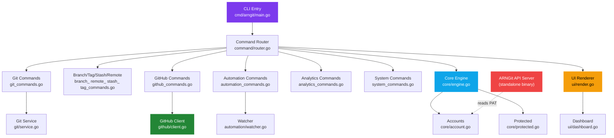

<p align="center">
  <pre align="center">
   _____                _______ __  
  /  _  \_______  ____ /  _____//__|_/  |_ 
 /  /_\  \_  __ \/    \/   \  __\|  \   __\
/    |    \  | \/   |  \    \_\  \  ||  |  
\____|__  /__|  |___|  /\______  /__||__|  
        \/           \/        \/          
  </pre>
</p>

<h3 align="center">Developer Control Platform</h3>

<p align="center">
  <em>A modern Git workflow tool with multi-account support, GitHub API integration, and automation.</em>
</p>

<p align="center">
  <a href="https://github.com/buchorim/arngit/releases/latest">
    
  </a>
  <a href="https://github.com/buchorim/arngit/releases/latest">
    
  </a>
  <a href="https://go.dev">
    
  </a>
  <a href="LICENSE">
    
  </a>
</p>

---

## Why ArnGit?

ArnGit is **not** a Git replacement. It's a **control layer** on top of Git that makes large-scale operations calm, understandable, and reversible.

```
arngit                     # Interactive dashboard
arngit push                # Push with account auto-config
arngit repo create myapp   # Create GitHub repo from terminal
arngit release create buchorim/myapp v2.0.0  # Ship a release
arngit bump minor          # Auto-increment version tag
```

### Key Principles

| Principle | Description |
|-----------|-------------|
| **Control** | Every destructive action requires confirmation |
| **Multi-Account** | Switch GitHub identities with one command |
| **Safety** | Repository protection prevents accidental pushes |
| **Automation** | Changelog, versioning, hooks - all built in |

---

## Installation

### Download Binary

Grab the latest release from [GitHub Releases](https://github.com/buchorim/arngit/releases/latest):

```bash
# Windows
curl -L -o arngit.exe https://github.com/buchorim/arngit/releases/latest/download/arngit.exe

# Move to PATH
move arngit.exe C:\Windows\System32\
```

### Build from Source

```bash
git clone https://github.com/buchorim/arngit.git
cd arngit

# Build with version info from git tag
go build -ldflags "-X main.Version=$(git describe --tags) -X main.BuildTime=$(date -u +%Y-%m-%dT%H:%M:%SZ) -X main.GitCommit=$(git rev-parse --short HEAD)" -o arngit.exe ./cmd/arngit
```

---

## Quick Start

```bash
# 1. Add your GitHub account (PAT required)
arngit account add personal

# 2. Verify connection
arngit account check

# 3. Start working
arngit
```

> The interactive dashboard launches when you run `arngit` with no arguments.

---

## Commands

### Git Operations

Standard Git commands with enhanced output and account-aware configuration.

```bash
arngit init                        # Initialize repository
arngit clone <url>                 # Clone with account setup
arngit status                      # Enhanced status view
arngit add <files>                 # Stage files
arngit commit -m "feat: login"     # Commit with message
arngit push [remote] [branch]      # Push (respects protection)
arngit pull                        # Pull changes
arngit diff [--staged]             # Show changes
arngit sync                        # Fetch + rebase
arngit history [-n 20]             # Commit log
arngit history --graph             # ASCII branch graph
arngit history --graph -n 30       # Graph with limit
```

---

### Branch & Tag Management

```bash
arngit branch list                 # List all branches
arngit branch new feature/auth     # Create and switch
arngit branch switch main          # Switch branch
arngit branch delete old-feature   # Delete branch

arngit tag list                    # List tags
arngit tag create v1.0.0           # Create tag
arngit tag delete v0.9.0           # Delete tag

arngit stash save "wip"            # Stash changes
arngit stash list                  # List stashes
arngit stash pop                   # Apply and drop

arngit remote list                 # List remotes
arngit remote add upstream <url>   # Add remote
arngit remote remove upstream      # Remove remote
```

---

### GitHub API

Manage repositories, releases, and pull requests directly from the terminal.

```bash
# Repositories
arngit repo list                   # List your repos
arngit repo create myproject       # Create public repo
arngit repo create myproject -p    # Create private repo
arngit repo delete owner/repo      # Delete (with confirmation)

# Releases
arngit release list owner/repo           # List releases
arngit release create owner/repo v2.0.0  # Create release
arngit release upload owner/repo v2.0.0 ./app.exe  # Upload asset

# Pull Requests
arngit pr list owner/repo                # List open PRs
arngit pr create owner/repo Fix login    # Create PR from current branch
```

---

### Automation

```bash
# Version Management
arngit bump                        # Auto-detect bump type
arngit bump major                  # 1.0.0 → 2.0.0
arngit bump minor                  # 1.0.0 → 1.1.0
arngit bump patch                  # 1.0.0 → 1.0.1

# Changelog
arngit changelog                   # Generate from latest tag
arngit changelog v1.0.0            # Generate since specific tag

# Git Hooks
arngit hooks list                  # Show installed hooks
arngit hooks install pre-commit    # Install hook template
arngit hooks uninstall pre-commit  # Remove hook

# Auto-Push Watcher
arngit watch                       # Watch with default thresholds
arngit watch --threshold commits --value 5     # Push every 5 commits
arngit watch --threshold time --value 10m      # Push every 10 minutes
arngit watch --threshold size --value 2MB       # Push when changes > 2MB

# Analytics
arngit stats                       # Repository statistics
arngit blame <file>                # File annotations
```

---

### Account Management

Encrypted PAT storage with AES-256-GCM. Switch between multiple GitHub identities.

```bash
arngit account add work            # Add account (interactive)
arngit account list                # List all accounts
arngit account switch personal     # Switch active account
arngit account current             # Show active account
arngit account check               # Validate PAT + show scopes
arngit account remove old          # Remove account
```

---

### System & Configuration

```bash
arngit config                      # Show all settings
arngit config set default_branch main
arngit config set color_output true

arngit doctor                      # System health check
arngit update                      # Self-update from GitHub Releases
arngit protect                     # Protect current repo
arngit unprotect                   # Remove protection
arngit storage                     # Show disk usage
arngit logs                        # View application logs
```

---

## ARNGit API Server

A **standalone companion tool** that exposes your GitHub data via local REST API. Separate binary, not embedded in arngit. Developer owns the security layer.

### How It Works

```
arngit (CLI)                    arngit-api (HTTP server)
├── ~/.arngit/accounts/ ───────> reads PAT from here
└── git workflow                └── REST endpoints → GitHub API
```

### Download

Grab `arngit-api.exe` from the same [release page](https://github.com/buchorim/arngit/releases/latest).

### Quick Start

```bash
# Start with readonly preset (all GET endpoints)
arngit-api --preset readonly

# Custom port
arngit-api --preset readonly --port 8080

# Full access (including write operations)
arngit-api --preset full

# Custom config file
arngit-api --config config.json
```

### Presets

| Preset | Endpoints | Write |
|--------|-----------|-------|
| `minimal` | `/status`, `/account` | No |
| `readonly` | All GET endpoints | No |
| `releases` | Status + releases only | Yes (create release) |
| `full` | Everything | Yes (create repo, release) |
| `custom` | Defined in `config.json` | Per-endpoint |

### Endpoints

| Method | Path | Description |
|--------|------|-------------|
| GET | `/status` | Server info, uptime, enabled endpoints |
| GET | `/account` | Current account (PAT never exposed) |
| GET | `/rate-limit` | GitHub API rate limit status |
| GET | `/repos` | List your repositories |
| GET | `/repos/:owner/:repo` | Repository detail |
| GET | `/repos/:owner/:repo/pulls` | Pull requests |
| GET | `/repos/:owner/:repo/issues` | Issues |
| GET | `/repos/:owner/:repo/releases` | Releases |
| POST | `/repos` | Create repository *(full preset)* |
| POST | `/repos/:owner/:repo/releases` | Create release *(releases/full preset)* |

### Example Usage

```bash
# Start server
arngit-api --preset readonly

# From any script/tool:
curl http://localhost:6700/status
curl http://localhost:6700/repos
curl http://localhost:6700/repos/buchorim/arngit/releases
curl http://localhost:6700/rate-limit

# Python example
python -c "
import requests
repos = requests.get('http://localhost:6700/repos').json()
for r in repos['data']:
    print(f\"{r['name']} - {'private' if r['private'] else 'public'}\")
"
```

### Response Format

All responses follow a consistent JSON structure:

```json
{
  "ok": true,
  "data": { ... },
  "timestamp": "2026-02-21T09:00:00Z"
}
```

Error responses:

```json
{
  "ok": false,
  "error": "message",
  "code": 404,
  "timestamp": "2026-02-21T09:00:00Z"
}
```

### Custom Config

Create a `config.json` to enable/disable individual endpoints:

```json
{
  "host": "127.0.0.1",
  "port": 6700,
  "preset": "custom",
  "endpoints": {
    "status":     { "enabled": true },
    "account":    { "enabled": true },
    "repos":      { "enabled": true,  "write": false },
    "pulls":      { "enabled": false },
    "issues":     { "enabled": false },
    "releases":   { "enabled": true,  "write": true },
    "rate_limit": { "enabled": true }
  }
}
```

### Adding Your Own Security

arngit-api ships with **zero auth** by design. You add what you need:

```go
// Token middleware example
func authMiddleware(next http.Handler) http.Handler {
    return http.HandlerFunc(func(w http.ResponseWriter, r *http.Request) {
        if r.Header.Get("X-API-Key") != os.Getenv("API_KEY") {
            http.Error(w, "unauthorized", 401)
            return
        }
        next.ServeHTTP(w, r)
    })
}

// Rate limiting, CORS, logging - add any middleware you need
// Fork the repo and modify server.go
```

---

## What's New

### v3.2.0

- **ARNGit API Server** - standalone REST server for GitHub data
  - Config-driven endpoint selection with 5 presets
  - Read + write operations (create repos, releases)
  - Zero-auth design - developer adds own security
- **Watch mode** - auto-push with threshold triggers (commits/time/size)
- **`history --graph`** - ASCII branch topology visualization
- **Dashboard refactor** - uses `git.Service` instead of raw `exec.Command`
- **Code split** - `git_commands.go` separated into 5 domain files

### v3.1.0

- First tagged build with ldflags versioning
- Removed source code from repo (binary-only distribution)

### v3.0.0

- **14 new commands** across GitHub API, Automation, Analytics
- GitHub API: repo create/list/delete, release create/upload, PR create/list
- Automation: hooks, changelog, version bump
- Analytics: stats, blame
- Account validation with PAT scope inspection
- PAT decryption fix (CRLF trimming)
- Comprehensive README with badges and Mermaid diagram

---

## Architecture



---

## Security

| Feature | Implementation |
|---------|---------------|
| PAT Storage | AES-256-GCM encryption, machine-bound key |
| Repo Protection | Prevents push to protected repositories |
| Delete Confirmation | All destructive actions require `[y/N]` |
| Update Verification | Binary updates only from official GitHub Releases |
| Token Scoping | PAT scope inspection via `account check` |
| API Server | Zero-auth by default, developer adds own layer |

---

## License

[MIT](LICENSE)

---

<p align="center">
  <sub>Built by <a href="https://github.com/buchorim">buchorim</a></sub>
</p>
